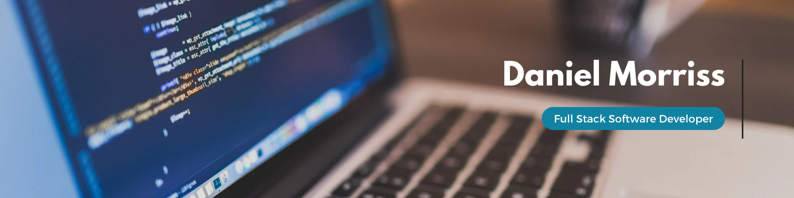

# Dan Morriss

## Full Stack Software Developer

### About Me

Hi there I'm Dan, a Junior Web Developer 👋🏻

I am currently working on my Level 5 Diploma in Full Stack Software Development with the Code Institute.

When I'm not coding, I can be found playing music 🎸, reading 📚, climbing 🧗, running 🏃‍♂️ with my dogs and spending time with my family 👨‍👩‍👦.

---

### Contact Me

---

### My Tech Stack

#### Languages

#### 🎨 Designs & Wireframes

#### 📚 Libraries & Frameworks

#### 🗃 Databases

#### 🏡 Hosting

#### 🧪 Testing

---

### Milestone Projects for Code Institute Diploma

<!-- **Overall Diploma Grade:** [Distinction](https://www.linkedin.com/in/keracudmore/overlay/education/769538001/multiple-media-viewer/?profileId=ACoAADfAcbgB85Z7ikekUTCZg3iLHHzQUCQYXng&treasuryMediaId=1635520854633) -->

Click here to view a summary of my Milestone Projects

| Milestone No. |                                                                                                            Project                                                                                                             |                                                                             Description                                                                             | Grade |
| :-----------: | :----------------------------------------------------------------------------------------------------------------------------------------------------------------------------------------------------------------------------: | :-----------------------------------------------------------------------------------------------------------------------------------------------------------------: | :---: |
|       1       | 

Marlborough Jazz Platform
 |               
A website created for a fictional monthly Jazz Platform hosted by some of jazz history's greatest players. Created using HTML & CSS.               | Merit |
|       2       |        

Music Theory Quiz
         |                                  
A quiz app designed to test your music theory knowledge! Created with HTML, CSS & JavaScript.                                   | Merit |
|       3       |       

Lumos Online Banking
        | 
An Python based online banking app with user and admin features. The programme uses Google Sheets as an external database to store all the user information.
 | Merit |
|       4       |                      

Niall's Barbershop
                       |     
A Django full stack booking system for a local barbershop allowing both users and staff to create and manage bookings with full CRUD functionality.
      |  TBC  |

---

### Hackathon Projects

I was nervous signing up for my first hackathon, but absolutely loved it, and came away with first place! Collaborating with others within a deadline using sprints and an agile methodology is incredibly rewarding.

Click here to view a summary of my Hackathon Projects

|                                                                                                                             Date, Theme & Organiser                                                                                                                              |                                                                                                                                                                                                                  Hackathon Project                                                                                                                                                                                                                   |                                                                               Place                                                                               |
| :------------------------------------------------------------------------------------------------------------------------------------------------------------------------------------------------------------------------------------------------------------------------------: | :--------------------------------------------------------------------------------------------------------------------------------------------------------------------------------------------------------------------------------------------------------------------------------------------------------------------------------------------------------------------------------------------------------------------------------------------------: | :---------------------------------------------------------------------------------------------------------------------------------------------------------------: |
|                                                                     
August 2023:

<a href="https://hackathon.codeinstitute.net/teams/338/">Retro Quest</a>

Organised by the Code Institute
                                                                     | 

Retro Mashup Mayhem - A JavaScrip game using the Kaboom.js framework inspired by retro arcade games.  <a href="https://retro-mashup-mayhem.netlify.app/">Live Site</a>  <a href="https://github.com/DarrachBarneveld/Retro-Mashup-Mayhem">Repo</a> |  |
| 
November 2023:
<a href="https://hackathon.codeinstitute.net/teams/369/">Movember</a>
Organised by <a href="https://www.eventbrite.co.uk/e/soda-social-x-code-institute-london-hackathon-tickets-737049122767?aff=oddtdtcreator">Soda Social & The Code Institute</a>
 |                                                                                        MenTool - A mood tracking app built using Django  <a href="https://mentool-2af96fd6f7e7.herokuapp.com/">Live Site</a>  <a href="https://github.com/DanMorriss/MenTool">Repo</a>                                                                                        |                                  Scrum Master                                |

<!-- - - - -->

<!-- ### Stats

 -->

<!--  -->

<!--  -->

<!--  -->
